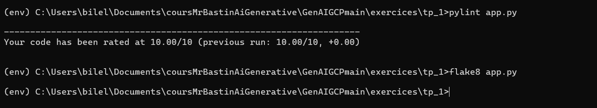

# How to use this repository

This repository contains exercises to help you deploy a RAG application in GCP.

## Expectations from Dauphine AI Students

### Evaluation Criteria
- **Code Quality**: Add `Flake8` and `Pylint` linters to your `settings.json` and use the warnings to improve your code.
- **Clean Code Principles**:
    - Follow the PEP8 standard.
    - Adopt the following practices:
        - Use type hints.
        - Use docstrings only if needed.
        - Utilize classes and functions.
        - Ensure each function performs a single task.
- **GCP Deployed Applications**:
    - The application should be deployed in GCP.
    - The interface should function as expected.
    - Avoid deploying multiple applications simultaneously.

### How to Submit Your Work
- TODO

### Mandatory Steps
- Prefix anything you deploy or create in GCP with your initials.

## Prerequisites

- [Python 3.11 or higher](https://www.python.org/downloads/)
- [Conda or Miniconda](https://docs.conda.io/projects/conda/en/latest/user-guide/install/index.html)
- [Docker](https://docs.docker.com/get-docker/)
- [VS Code](https://code.visualstudio.com/download)
- [GCloud SDK](https://cloud.google.com/sdk/docs/install)
- [Cloud SQL Proxy](https://cloud.google.com/sql/docs/mysql/sql-proxy#install)

## Create Your Virtual Environment

```bash
conda create --name genai_gcp python=3.11
conda activate genai_gcp
pip install -r requirements.txt
```

## Authenticate on GCP

```bash
gcloud init # Use your email and project settings
gcloud auth login
gcloud auth application-default login # Authenticate on GCP with admin account
```

## Commands Used ONLY by the Teacher to Create Required Objects in GCP

### Configure API, IAM, and Service Account

```bash
gcloud init # Use your email and project settings
gcloud auth application-default login # Authenticate on GCP with admin account
gcloud storage buckets create gs://<my-tfstate-bucket> --project=<my-project-id> --location=<my-region> # You need storage.buckets.create permission (ex: roles/editor)
cd terraform/bootstrap
vim backend.tf
# Edit <my-tfstate-bucket> with the name of the bucket created above
vim terraform.tfvars
# Edit the values of project_id, location, artifactregistry_name, and service_account_name
terraform init # You need storage.buckets.list permission (ex: roles/storage.objectUser)
terraform apply -var gcp_account_email="<my-user-email>"
# Return the service account to be copied next line
export GOOGLE_IMPERSONATE_SERVICE_ACCOUNT=<my-service-account>@<my-project-id>.iam.gserviceaccount.com
```

## About the Exercises

This repository contains exercises to help you deploy a RAG application in GCP. Complete the exercises in the following order:
| TP Number | Link | Description |
|-----------|------|-------------|
| 1 | [Open exercice](./exercices/tp_1) | Create a basic Streamlit app in Cloud Run. |
| 2 | [Open exercice](./exercices/tp_2) | Split the backend and frontend of your app and deploy in Cloud Run. |
| 3 | [Open exercice](./exercices/tp_3) | Use Gemini LLM to create a basic question-answering app without external knowledge. |
| 4 | [Open exercice](./exercices/tp_4) | Create and fill a Cloud SQL instance with the data needed for the RAG model: <ul><li>Load the data in Google Cloud Storage.</li><li>Chunk the data with Google Cloud Functions and add it to the Cloud SQL instance.</li><li>Update the data with Google Cloud Functions when new data is added to the bucket.</li></ul> |
| 5 | [Open exercice](./exercices/tp_5) | Use this data hosted in Cloud SQL to improve your question-answering app. |
| 6 | [Open exercice](./exercices/tp_6) | Use the RAG model to improve your question-answering app. |
| 7 | [Open exercice](./exercices/tp_7) | Collect user feedback from your app and store it in BigQuery. |
| 8 | [Open exercice](./exercices/tp_8) | Explore alternative architectures for deploying the RAG model in production, such as using Dialogflow. |

## Roadmap
- Terraform Cloud SQL instance and DB ingestion.
- Terraform User IAM.

### Troubleshooting

You will encounter many errors during development. Don't worry; it's part of the learning process. Here are a few hints on how to solve them:

```bash
- ERROR: Cannot connect to the Docker daemon # Docker app is not opened
- An env variable is not recognized # Check the .env file, run source .env in the terminal, load_dotenv() in the Python file
```
GenAIGCPmain (Projet Google Cloud Platform)

### Description
Ce projet se concentre sur le déploiement d'applications RAG (Retrieval-Augmented Generation) sur Google Cloud Platform. Il met en pratique les concepts d'IA générative dans un environnement cloud professionnel.

### Prérequis Techniques
- Python 3.11 ou supérieur
- Docker
- VS Code
- GCloud SDK
- Cloud SQL Proxy
- Conda/Miniconda

### Configuration de l'Environnement GCP
```bash
conda create --name genai_gcp python=3.11
conda activate genai_gcp
pip install -r requirements.txt

# Configuration GCP
gcloud init
gcloud auth login
gcloud auth application-default login
```

### Structure du Projet
- `arena/` : Zone de développement principal
- `exercices/` : Exercices pratiques de déploiement
- `terraform/` : Scripts d'infrastructure as code
- `docs/` : Documentation technique

### Critères d'Évaluation
1. **Qualité du Code**
   - Utilisation de Flake8 et Pylint
   - Respect des standards PEP8
   - Type hints
   - Documentation appropriée
   - Organisation en classes et fonctions

2. **Déploiement GCP**
   - Application fonctionnelle sur GCP
   - Interface utilisateur opérationnelle
   - Gestion appropriée des ressources cloud

### Règles Importantes
- Préfixer tous les éléments déployés sur GCP avec vos initiales
- Maintenir une organisation claire du code
- Éviter les déploiements multiples simultanés

## Vérification de la Qualité du Code

### TP 1
Résultats des tests de qualité :


### TP 2
Résultats des tests de qualité :


### TP 3
Résultats des tests de qualité :


### TP 4
Résultats des tests de qualité :


## Outils de Qualité du Code

Les projets utilisent plusieurs outils pour maintenir une haute qualité de code :
- **Pylint** : Vérification de la conformité avec les conventions PEP 8
- **Flake8** : Détection des erreurs de style et des bugs potentiels

