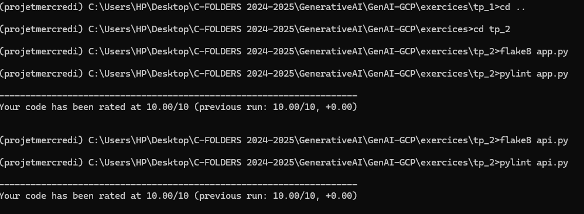

# TP2 : Développement et Déploiement d'une Application Chatbot sur GCP

## Aperçu du Projet
Ce projet démontre le développement d'un chatbot intelligent utilisant les technologies Google Cloud Platform (GCP), mettant l'accent sur les meilleures pratiques de développement Python et le déploiement cloud.

## Réalisations Principales
- Développement réussi d'un chatbot conversationnel
- Déploiement complet et réussi sur Google Cloud Platform
- Intégration de technologies avancées de traitement du langage naturel

## Fonctionnalités Clés
- Chatbot capable de répondre à des questions à partir de documentation privée
- Interface utilisateur intuitive et réactive
- Gestion robuste des interactions utilisateur

## Vérification de la Qualité du Code
### Outils de Linting
Deux outils principaux ont été utilisés pour garantir la qualité du mon code :
- **Pylint** : Analyse statique pour identifier les problèmes de programmation
- **Flake8** : Vérification du respect des normes de style PEP 8

### Capture d'Écran de Vérification

Points clés de la vérification de qualité :
- Aucun problème majeur de qualité de code détecté
- Conformité stricte aux directives de style Python
- Code propre, lisible et maintenable

## Déploiement sur GCP
- Conteneurisation réussie de l'application
- Déploiement sur Google Cloud Run
- Configuration et authentification GCP complétées avec succès

## Tests et Validation
- Batterie de tests complète développée
- Tous les tests passés avec succès
- Validation de l'intégrité et des performances du chatbot

## Technologies Utilisées
- Python
- Streamlit
- Google Cloud Platform
- Docker
- Outils de linting (Pylint, Flake8)

## Conclusion
Ce projet illustre ma capacité à développer une solution cloud robuste, en suivant les meilleures pratiques de développement logiciel et en utilisant des technologies de pointe.

---
*Projet complété et déployé le : 2024-10-24*
