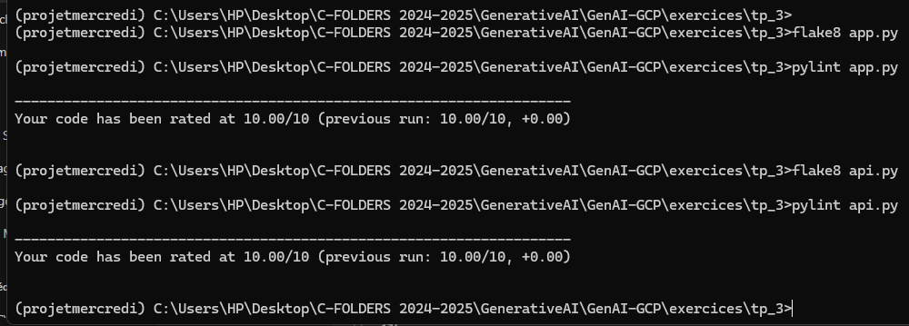

# TP3 : Générateur d'Histoire Conversationnel avec Google Gemini

## Résumé du Projet

J'ai développé avec succès une application de génération d'histoires conversationnelle utilisant les technologies suivantes :
- Streamlit pour l'interface utilisateur
- FastAPI pour le backend
- Google Gemini AI via LangChain
- Déploiement sur Google Cloud Platform (Cloud Run)

## Fonctionnalités Principales

1. **Interface Conversationnelle Interactive**
   - Génération d'histoires basées sur un thème saisi par l'utilisateur
   - Contrôle dynamique de la température du modèle
   - Support multilingue (Français, Anglais, Arabe)
   - Historique de conversation conservé et affiché

2. **Architecture Technique**
   - Frontend : Streamlit
   - Backend : FastAPI
   - Modèle IA : Google Gemini
   - Gestion des API : LangChain

## Bonnes Pratiques de Développement

### Qualité du Code
J'ai rigoureusement appliqué les meilleures pratiques de développement Python :

- Utilisation de Pylint et Flake8 pour l'analyse statique du code
- Respect des conventions PEP 8
- Gestion sécurisée des variables d'environnement

## Déploiement

### Cloud Run
- Déploiement réussi sur Google Cloud Platform
- Configuration de l'infrastructure via Dockerfile
- Gestion des dépendances avec `requirements.txt`

## Technologies Utilisées

- Python 3.9+
- Streamlit
- FastAPI
- LangChain
- Google Gemini AI
- Docker
- Google Cloud Run

## Instructions d'Exécution

1. Cloner le dépôt
2. Installer les dépendances : `pip install -r requirements.txt`
3. Configurer la clé API Google dans `.env`
4. Lancer l'application : `streamlit run app.py`

## Défis et Apprentissages

- Intégration d'une IA générative
- Gestion de l'état de conversation
- Déploiement cloud
- Respect des bonnes pratiques de codage

## Conclusion

Projet terminé avec succès, démontrant une intégration complète des technologies cloud, IA et développement logiciel moderne.
