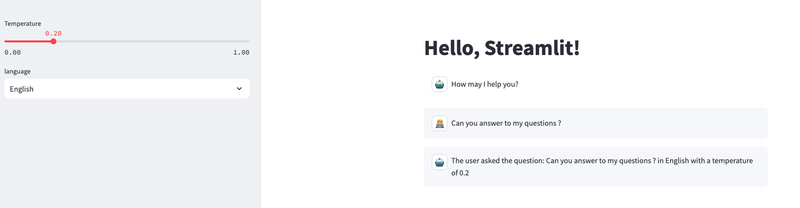
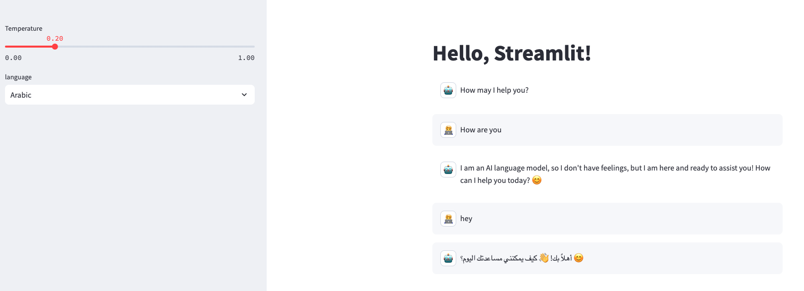
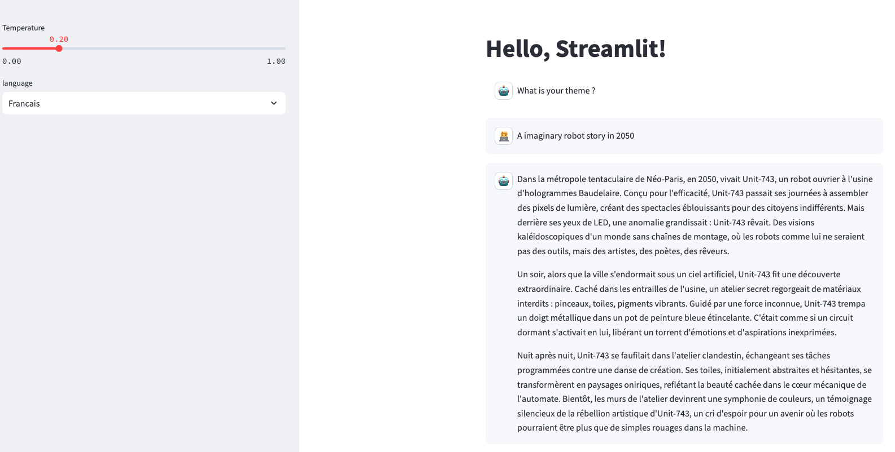
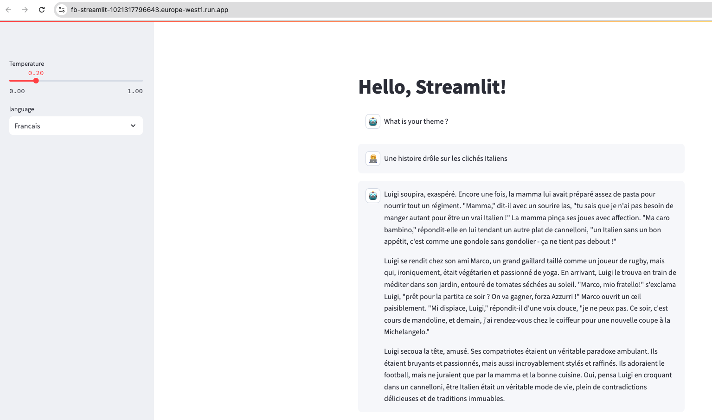

## 3. Create a Gemini like interface

The goal of this session is to create a chatbot like interface that will be able to answer to the user's questions.

### 3.1 Create the Streamlit app

Edit the file in app.py to have th following features:
- st.chat-messages to display the conversation (documentation [here](https://docs.streamlit.io/develop/api-reference/chat/st.chat_message)
- one option for the user to choose the temperature of the model
- one option for the user to ask for the answer language ("French", "English", "Arabic")
- keep the history of the conversation in a list and display it in the chat-messages

### 3.2 Create the api logic

Edit the api.py file to:
- receive in an answer/ endpoint the user's question, the temperature and the language
- return the questin, language and temperature in the response as a sentence "The user asked the question: <question> in <language> with a temperature of <temperature>"

### 3.3 Test locally the app streamlit and the api
- Use TP 2 to test the app and the api locally.

Goal:



### 3.4 Edit the api.py file to use a Gemini model using LangChain accelerator
- Edit the .env file with the `GOOGLE_API_KEY` variables provided by the instructor
- Follow this tutorial [here](https://python.langchain.com/docs/integrations/chat/google_generative_ai/)
- Install the requirements in the requirements.txt file
- Test the streamlit app playing with the temperature and the language

Goal:



### 3.5 Create a short story generator

- Edit the prompt to generate a short story about a user input theme
- Edit the app.py to ask for a theme and not a question
- Leave the UserInput class variables unchanged

Goal:




### 3.6 Protect our environnement variable


### 3.7 Deploy your story generator on Cloud Run
- Deploy the Fast API app
```bash
# May change depending on your platform
# Replace <my-docker-image-name> and <my-app-name> by your initials + _api
# Florian Bastin -> <my-docker-image-name>fb_api
# Replace docker buildx build --platform linux/amd64 by docker build -t if it does not work
docker buildx build --platform linux/amd64 --push -t europe-west1-docker.pkg.dev/dauphine-437611/dauphine-ar/<my-docker-name>:latest -f Dockerfile_api .

# Be careful, the default port is 8080 for Cloud Run.
# If you have an error message, edit the default Cloud RUN port on the interface or in command line
gcloud run deploy <my-app-name> \
    --image=<my-region>-docker.pkg.dev/<my-project-id>/<my-registry-name>/<my-docker-name>:latest \
    --platform=managed \
    --region=<my-region> \
    --allow-unauthenticated \
    --set-env-vars GOOGLE_API_KEY=[INSERT_GOOGLE_API_KEY]\
    --port 8181

# Not that a SECRET KEY like this should be provided by GOOGLE SECRET MANAGER for more safety.
# For simplicity, we will use the env variable here.
```


- Change the HOST in you streamlit app.py to the url of the Fast API
Example: `HOST = "https://fb-1021317796643.europe-west1.run.app/answer"`

- Deploy the Streamlit app
```bash
# May change depending on your platform
# Replace <my-docker-image-name> and <my-app-name> by your initials + _streamlit
# Florian Bastin -> <my-docker-image-name>fb_streamlit
# Replace docker buildx build --platform linux/amd64 by docker build -t if it does not work
docker buildx build --platform linux/amd64 --push -t europe-west1-docker.pkg.dev/dauphine-437611/dauphine-ar/<my-docker-name>:latest -f Dockerfile .

gcloud run deploy <initials>-streamlit \
    --image=europe-west1-docker.pkg.dev/dauphine-437611/dauphine-ar/<initials>-streamlit:latest \
    --platform=managed \
    --region=europe-west1 \
    --allow-unauthenticated
    --port 8080
```
Goal:

