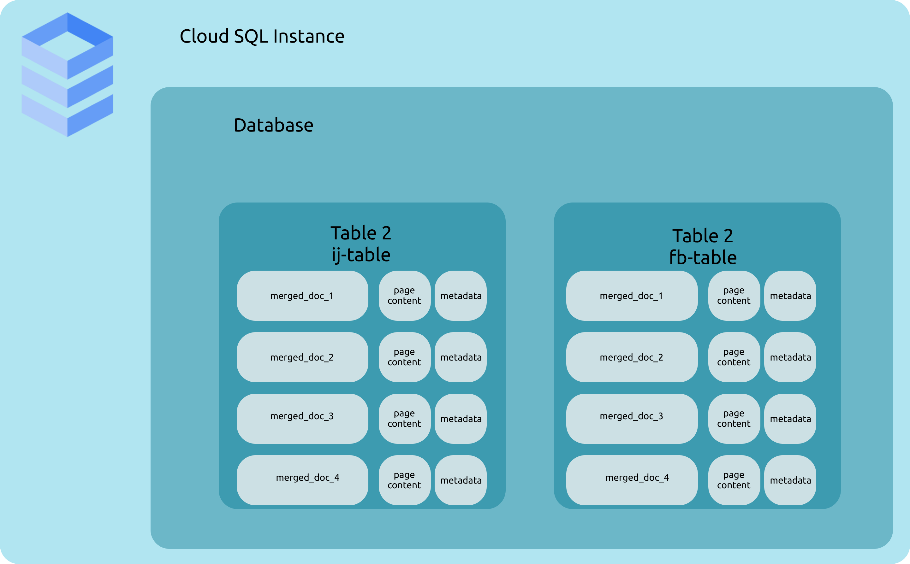
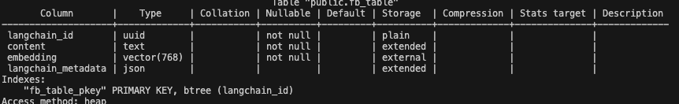

## 4. Ingest your data in a Cloud SQL database

The goal of this session is to ingest our knowledge base in a Cloud SQL database.
The data are the Gen AI Dauphine Tunis Google Slides

We will skip the following steps:
- Creating a Cloud SQL database
- Inserting data in the Cloud SQL database
- Creating a PG vector extension in the Cloud SQL database

This [tutorial](https://python.langchain.com/docs/integrations/vectorstores/google_cloud_sql_pg/) will help you realize this exercice.

### I. Read and download files from Google Cloud Storage
- Open `tp_4/gcs_to_cloudsql.ipynb` and fill the TODOs of I.

### II. Test locally the app streamlit and the api
- Open `tp_4/gcs_to_cloudsql.ipynb` and fill the TODOs of II.
    -   Add the merged document to a table in the Cloud SQL database

Goal:




The created table should look like this:




### III. Create a Python file to automate the process

Create a Python file to automate the process of ingesting the data in Cloud SQL.
1. Open the file exercices/tp_4/ingest.py and create the following functions:
- List all the files in the bucket
- Download locally a file
- Load the content of the file with unsctructured
- Merge the content of the file by page
- Create a table if the table don't exists
- Get embeddings methods
- Ingest the data in the table
- Create a `store` instance

2. Open the file exercices/tp_4/retrieve.py and create the following functions:
- Perform a similarity search

To verify the correctness of your code, you can run the following command:
```bash
python ingest.py
python retrieve.py
```

### IV. Edit the API to perform a similarity search

- Open `tp_4/api.py` and fill the TODOs.

Hint: You can use the tests in `ingest.py` and `retrieve.py` to edit `api.py`

You have to:
- Create a Cloud SQL connection
- Perform a similarity search from a user query
- Edit the root `get_sources` API route function to return the relevant documents

### V. Test the API

- Open `tp_4/app.py` and fill the TODOs

### VI. Test locally

- Launch the API: `uvicorn api:app --host 0.0.0.0 --port 8181`
- Set the HOST to app.py
- Laucnn the app: `streamlit run app.py`

Here we just display the relevant documents from a user query.
We don't ask the LLM to answer from theses documents.

### VII. Deploy the API

- Deploy the Fast API app
```bash
# May change depending on your platform
# Replace <my-docker-image-name> and <my-app-name> by your initials + _api
# Florian Bastin -> <my-docker-image-name>fb_api
# Replace docker buildx build --platform linux/amd64 by docker build -t if it does not work
docker buildx build --platform linux/amd64 --push -t europe-west1-docker.pkg.dev/dauphine-437611/dauphine-ar/<my-docker-name>:latest -f Dockerfile_api .

# Be careful, the default port is 8080 for Cloud Run.
# If you have an error message, edit the default Cloud RUN port on the interface or in command line
gcloud run deploy <my-app-name> \
    --image=<my-region>-docker.pkg.dev/<my-project-id>/<my-registry-name>/<my-docker-name>:latest \
    --platform=managed \
    --region=<my-region> \
    --allow-unauthenticated \
    --set-env-vars GOOGLE_API_KEY=[INSERT_GOOGLE_API_KEY],DB_PASSWORD=[INSERT_DB_PASSWORD] \
    --port 8181

# Not that a SECRET KEY like this should be provided by GOOGLE SECRET MANAGER for more safety.
# For simplicity, we will use the env variable here.
```


- Change the HOST in you streamlit app.py to the url of the Fast API
Example: `HOST = "https://fb-1021317796643.europe-west1.run.app/answer"`

- Deploy the Streamlit app
```bash
# May change depending on your platform
# Replace <my-docker-image-name> and <my-app-name> by your initials + _streamlit
# Florian Bastin -> <my-docker-image-name>fb_streamlit
# Replace docker buildx build --platform linux/amd64 by docker build -t if it does not work
docker buildx build --platform linux/amd64 --push -t europe-west1-docker.pkg.dev/dauphine-437611/dauphine-ar/<my-docker-name>:latest -f Dockerfile .

gcloud run deploy <initials>-streamlit \
    --image=europe-west1-docker.pkg.dev/dauphine-437611/dauphine-ar/<initials>-streamlit:latest \
    --platform=managed \
    --region=europe-west1 \
    --allow-unauthenticated
    --port 8080
```