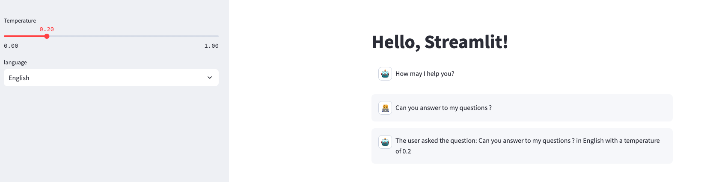
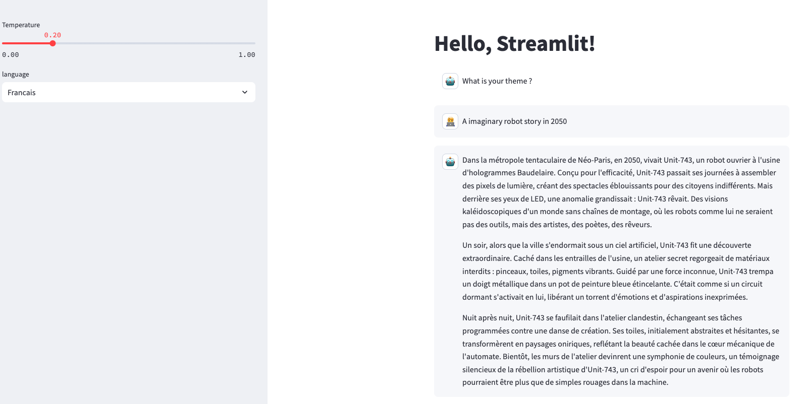

uvicorn api:app --reload --port 8080
api:app : Cela signifie que l'application FastAPI (app) se trouve dans le fichier api.py.
--reload : Permet le rechargement automatique en cas de modification du code.
--port 8001 : Définit le port sur lequel FastAPI écoutera les requêtes.
streamlit run app.py 

## 3. Create a Gemini-like Interface

The goal of this session is to create a chatbot-like interface that will be able to answer the user's questions.

### 3.1 Create the Streamlit App

Edit the `app.py` file to have the following features:
- `st.chat_message` to display the conversation (documentation [here](https://docs.streamlit.io/develop/api-reference/chat/st.chat_message))
- An option for the user to choose the temperature of the model
- An option for the user to select the answer language ("French", "English", "Arabic")
- Keep the history of the conversation in a list and display it in the chat messages

### 3.2 Create the API Logic

Edit the `api.py` file to:
- Receive in an `/answer` endpoint the user's question, the temperature, and the language
- Return the question, language, and temperature in the response as a sentence: "The user asked the question: `<question>` in `<language>` with a temperature of `<temperature>`"

### 3.3 Test Locally the Streamlit App and the API
- Use TP 2 to test the app and the API locally.

Goal:



### 3.4 Edit the `api.py` File to Use a Gemini Model Using LangChain Accelerator
- Edit the `.env` file with the `GOOGLE_API_KEY` variables provided by the instructor
- Follow this tutorial [here](https://python.langchain.com/docs/integrations/chat/google_generative_ai/)
- Install the requirements in the `requirements.txt` file
- Test the Streamlit app by adjusting the temperature and the language

Goal:


### 3.5 Create a Short Story Generator

- Edit the prompt to generate a short story about a user-input theme
- Edit the `app.py` to ask for a theme instead of a question
- Leave the `UserInput` class variables unchanged

Goal:



from langchain_google_genai.chat_models import ChatGoogleGenerativeAI


### 3.6 Protect Our Environment Variable

### 3.7 Deploy Your Story Generator on Cloud Run
- Deploy the FastAPI app
```bash
# May change depending on your platform
# Replace <my-docker-image-name> and <my-app-name> with your initials + _api
# Florian Bastin -> <my-docker-image-name>fb_api
# Replace docker buildx build --platform linux/amd64 with docker build -t if it does not work
docker buildx build --platform linux/amd64 --push -t europe-west1-docker.pkg.dev/dauphine-437611/dauphine-ar/<my-docker-name>:latest -f Dockerfile_api .

# Be careful, the default port is 8080 for Cloud Run.
# If you have an error message, edit the default Cloud Run port on the interface or in the command line
gcloud run deploy <my-app-name> \
    --image=<my-region>-docker.pkg.dev/<my-project-id>/<my-registry-name>/<my-docker-name>:latest \
    --platform=managed \
    --region=<my-region> \
    --allow-unauthenticated \
    --set-env-vars GOOGLE_API_KEY=[INSERT_GOOGLE_API_KEY] \
    --port 8181

# Note that a SECRET KEY like this should be provided by GOOGLE SECRET MANAGER for more safety.
# For simplicity, we will use the env variable here.
```

- Change the HOST in your `app.py` to the URL of the FastAPI
Example: `HOST = "https://fb-1021317796643.europe-west1.run.app/answer"`

- Deploy the Streamlit app
```bash
# May change depending on your platform
# Replace <my-docker-image-name> and <my-app-name> with your initials + _streamlit
# Florian Bastin -> <my-docker-image-name>fb_streamlit
# Replace docker buildx build --platform linux/amd64 with docker build -t if it does not work
docker buildx build --platform linux/amd64 --push -t europe-west1-docker.pkg.dev/dauphine-437611/dauphine-ar/<my-docker-name>:latest -f Dockerfile .

gcloud run deploy <initials>-streamlit \
    --image=europe-west1-docker.pkg.dev/dauphine-437611/dauphine-ar/<initials>-streamlit:latest \
    --platform=managed \
    --region=europe-west1 \
    --allow-unauthenticated \
    --port 8080
```
Goal:


installation : 


""" from dotenv import load_dotenv
import os
from langchain_google_genai import ChatGoogleGenerativeAI

# Charger les variables d'environnement depuis le fichier .env
load_dotenv()

# Récupérer la clé API depuis l'environnement
google_api_key = os.getenv("GOOGLE_API_KEY")

if not google_api_key:
    raise ValueError("La clé API Google n'a pas été trouvée dans le fichier .env.")

# Configurer le modèle avec la clé API
llm = ChatGoogleGenerativeAI(
    model="gemini-1.5-pro",  # Spécifiez le modèle à utiliser
    api_key=google_api_key, # Passez la clé API directement
    temperature=0.7,        # Contrôle de la créativité
    max_tokens=256,         # Limite de tokens générés
    max_retries=3           # Nombre de tentatives en cas d'échec
)

# Exemple de messages pour le chatbot
messages = [
    ("system", "You are a helpful assistant."),
    ("human", "What is the capital of France?"),
]

# Envoyer une requête au modèle et obtenir la réponse
response = llm.invoke(messages)

# Afficher uniquement la partie utile de la réponse
print(f"Réponse : {response.content.strip()}")


pip install python-dotenv
pip install -qU langchain-google-genai

pip install --upgrade google-cloud-core grpcio google-auth google-ai-generativelanguage

PREMIER CONSTICTION   :  helpful assistant 
api.py : 
from fastapi import FastAPI
from pydantic import BaseModel
from langchain_google_genai import ChatGoogleGenerativeAI
from dotenv import load_dotenv
import os

# Charger les variables d'environnement
load_dotenv()

# Charger la clé API Google
google_api_key = os.getenv("GOOGLE_API_KEY")
if not google_api_key:
    raise ValueError("La clé API Google n'a pas été trouvée dans le fichier .env.")

# Initialiser FastAPI
app = FastAPI()

# Modèle de données pour la requête utilisateur
class UserInput(BaseModel):
    question: str
    temperature: float
    language: str

# Endpoint pour répondre aux questions
@app.post("/answer")
def answer(user_input: UserInput):
    # Configurer le modèle avec la température utilisateur
    chat = ChatGoogleGenerativeAI(
        model="gemini-1.5-pro",
        api_key=google_api_key,
        temperature=user_input.temperature,  # Configurer la température ici
        max_tokens=256,
        max_retries=3
    )

    # Construire les messages pour le modèle
    messages = [
        ("system", f"You are a helpful assistant answering questions in {user_input.language}."),
        ("human", user_input.question),
    ]

    try:
        # Envoyer une requête au modèle
        response = chat.invoke(messages)

        # Retourner la réponse générée
        return {
            "message": response.content.strip(),
            "input_summary": f"The user asked the question: '{user_input.question}' in '{user_input.language}' with a temperature of {user_input.temperature}"
        }

    except Exception as e:
        # Gestion des erreurs
        return {"error": str(e)}

app.py : 
"""Streamlit app"""
import streamlit as st
import requests

# URL de l'API
API_URL = "http://127.0.0.1:8000"

st.title("Hello, Streamlit!")

# Barre latérale pour les paramètres
with st.sidebar:
    st.header("Settings")
    language = st.selectbox("Language", ["English", "French", "Arabic"])
    temperature = st.slider("Temperature", min_value=0.0, max_value=1.0, value=0.5)

# Initialiser l'état de session pour la conversation
if "messages" not in st.session_state:
    st.session_state["messages"] = [
        {"role": "assistant", "content": "How may I help you?"}
    ]

# Champ d'entrée pour l'utilisateur
if user_input := st.chat_input("Type your question here..."):
    st.session_state["messages"].append({"role": "user", "content": user_input})

    # Préparer la requête pour l'API
    payload = {
        "question": user_input,
        "temperature": temperature,
        "language": language
    }

    # Envoyer la requête à l'API
    try:
        response = requests.post(f"{API_URL}/answer", json=payload)
        response.raise_for_status()
        api_response = response.json()

        # Ajouter la réponse de l'API à la conversation
        if "message" in api_response:
            st.session_state["messages"].append({"role": "assistant", "content": api_response["message"]})
        else:
            st.error(f"The API response does not contain the expected field. Response: {api_response}")
    except requests.exceptions.RequestException as e:
        st.error(f"Error communicating with the API: {e}")

# Afficher la conversation
for msg in st.session_state["messages"]:
    with st.chat_message(msg["role"]):
        st.write(msg["content"])


2 strory teller : 

api.py : from fastapi import FastAPI
from pydantic import BaseModel
from langchain_google_genai import ChatGoogleGenerativeAI
from dotenv import load_dotenv
import os

# Load environment variables
load_dotenv()

# Retrieve the Google API key
google_api_key = os.getenv("GOOGLE_API_KEY")
if not google_api_key:
    raise ValueError("Google API Key not found in the environment variables.")

# Initialize FastAPI
app = FastAPI()

# Initialize the Google Generative AI model
llm = ChatGoogleGenerativeAI(
    model="gemini-1.5-pro",
    api_key=google_api_key,
    max_tokens=500,  # Increased for story generation
    max_retries=3,
)

# Data model for user input
class UserInput(BaseModel):
    question: str  # Will represent the theme
    temperature: float
    language: str

# Endpoint for short story generation
@app.post("/generate-story")
def generate_story(user_input: UserInput):
    # Construct the messages for the model
    messages = [
        (
            "system",
            f"You are a creative writer generating short stories in {user_input.language}. "
            "Create a captivating short story based on the following theme."
        ),
        ("human", user_input.question),
    ]

    try:
        # Invoke the model to generate a story
        response = llm.invoke(messages, temperature=user_input.temperature)

        # Return the generated story
        return {
            "story": response.content.strip(),
            "input_summary": f"The user requested a story based on the theme: '{user_input.question}' "
                             f"in '{user_input.language}' with a temperature of {user_input.temperature}.",
        }
    except Exception as e:
        # Handle errors gracefully
        return {"error": str(e)}

app.py :
import streamlit as st
import requests

# API URL
API_URL = "http://127.0.0.1:8000"

st.title("Hello, Streamlit!")
st.subheader("Create a Short Story Generator")

# Sidebar for settings
with st.sidebar:
    st.header("Settings")
    language = st.selectbox("Language", ["English", "French", "Arabic"])
    temperature = st.slider("Temperature", min_value=0.0, max_value=1.0, value=0.5)

# Initialize session state for the story
if "story" not in st.session_state:
    st.session_state["story"] = None

# User input for theme
theme = st.text_input("What is your theme?")

# Generate story button
if st.button("Generate Story"):
    if theme.strip():
        # Prepare payload for API
        payload = {
            "question": theme,
            "temperature": temperature,
            "language": language,
        }

        # Call the API
        try:
            response = requests.post(f"{API_URL}/generate-story", json=payload)
            response.raise_for_status()
            api_response = response.json()

            # Display the generated story
            if "story" in api_response:
                st.session_state["story"] = api_response["story"]
            else:
                st.error(f"The API response does not contain the expected field. Response: {api_response}")
        except requests.exceptions.RequestException as e:
            st.error(f"Error communicating with the API: {e}")
    else:
        st.error("Please enter a theme for the story.")

# Display the story if it exists
if st.session_state["story"]:
    st.subheader("Your Short Story")
    st.write(st.session_state["story"])

ok


# DEPLOIMENT :  Pousser l'image vers Artifact Registry
docker build -t chatapi:latest -f Dockerfile_api .
docker tag chatapi:latest europe-west1-docker.pkg.dev/dauphine-437611/dauphine-ar/chatapi:latest
docker push europe-west1-docker.pkg.dev/dauphine-437611/dauphine-ar/chatapi:latest


Build et Push
docker buildx build --platform linux/amd64 --push `
    -t europe-west1-docker.pkg.dev/dauphine-437611/dauphine-ar/chatapi:latest `
    -f Dockerfile_api .

# ------------------------------------------------------
Construisez et déployez l'API sur Google Cloud Run avec le Dockerfile Dockerfile_api :


docker buildx build --platform linux/amd64 --push -t europe-west1-docker.pkg.dev/dauphine-437611/dauphine-ar/chatapi:latest -f Dockerfile_api .

Puis déployez sur Google Cloud Run :


gcloud run deploy emchatapi `
    --image=europe-west1-docker.pkg.dev/dauphine-437611/dauphine-ar/chatapi:latest `
    --platform=managed `
    --region=europe-west1 `
    --allow-unauthenticated `
    --set-env-vars GOOGLE_API_KEY="********************" `
    --port=8080

# recupurer url :    https://emchatapi-1021317796643.europe-west1.run.app

gcloud run services describe emchatapi --platform managed --region europe-west1 --format "value(status.url)"
https://emchatapi-63idnujfwq-ew.a.run.app


Construisez et déployez l'interface Streamlit avec le Dockerfile Dockerfile :

 docker buildx build --platform linux/amd64 --push -t europe-west1-docker.pkg.dev/dauphine-437611/dauphine-ar/emchat-streamlit:latest -f Dockerfile .


 gcloud run deploy emchat-streamlit `
    --image=europe-west1-docker.pkg.dev/dauphine-437611/dauphine-ar/emchat-streamlit:latest `
    --platform=managed `
    --region=europe-west1 `
    --allow-unauthenticated `
    --port 8080


